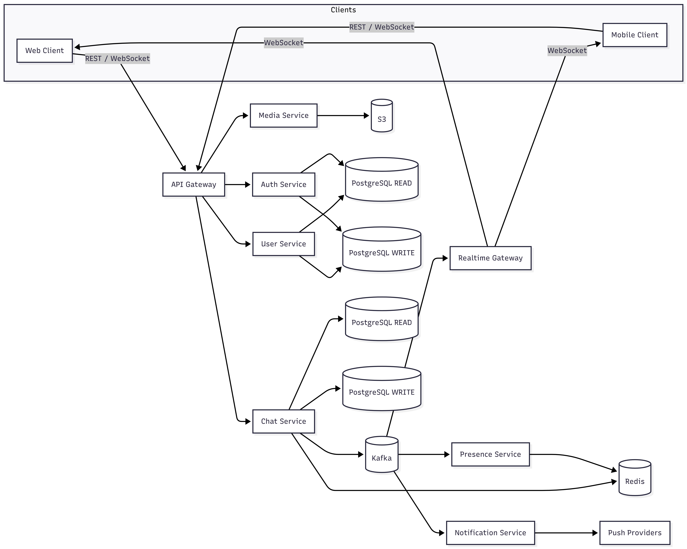

# Realtime Chat Architecture

## High-Level Architecture
This system consists of several connected services:
1. Client Applications
    - Mobile apps or web apps
    - Maintain realtime connections to the backend
2. Realtime Gateway
    - WebSocket-based gateway
    - Handles persistent client connections
    - Responsible for authentication, connection lifecycle, and routing messages
    - Horizontally scalable and stateless
3. Messaging Service
    - Processes incoming chat messages
    - Applies validation and persistence
    - Publishes messages to a message broker
4. Message Broker
    - Kafka / Redis Streams
    - Enables fan-out, buffering, and decoupling between services
    - Supports horizontal scaling and fault tolerance
5. Delivery / Fan-out Service
    - Consumes messages from the broker
    - Delivers messages to online users via the gateway
    - Handles presence awareness and routing
6. Storage Layer
    - Relational DB (PostgreSQL) for metadata
    - object storage (media)
    - Redis for caching and presence

## Realtime Message Flow (Chat Example)
1. Client connects to the Realtime Gateway via WebSocket
2. Client sends a message
3. Gateway forwards the message to the Messaging Service
4. Message is persisted and published to the Message Broker
5. Delivery service consumes the event
6. Message is pushed to all subscribed/online recipients

## Scalability Considerations
- All services are stateless and horizontally scalable
- Message broker topics/streams are partitioned
- WebSocket connections are distributed across gateway instances
- Presence data is stored in Redis for fast access

## Fault Tolerance & Reliability
- Client reconnection handling at the gateway
- At-least-once delivery via message broker
- Idempotent message processing
- Retry and backoff strategies
- Graceful degradation for offline users

## Technology Choices
- Golang for high concurrency and low latency
- WebSocket for bidirectional realtime communication
- Kafka / Redis Streams for event-driven architecture
- Redis for caching and presence
- PostgreSQL for strong consistency where needed